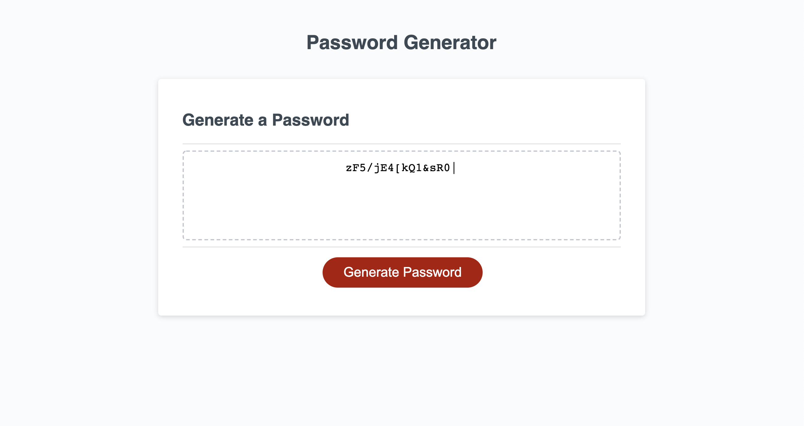

# Password Generator Starter Code

# Description

Module 3 JavaScript challenge. This password generator will let you create a random password with a length of between 8 and 128, and use any combination of lowercase and uppercase letters, numbers 0-9, and a selection of special symbols " !#$%&'()*+,-./:;<=>?@[]_'{|}~".

It will not let you create a password shorter than 8 or larger than 128, and it will only accept a numerical input. It will also make sure at least one character type is selected.

# Languages Used

* HTML
* CSS
* Javascript

# Link

https://simmonsw.github.io/upgraded-fiesta/
